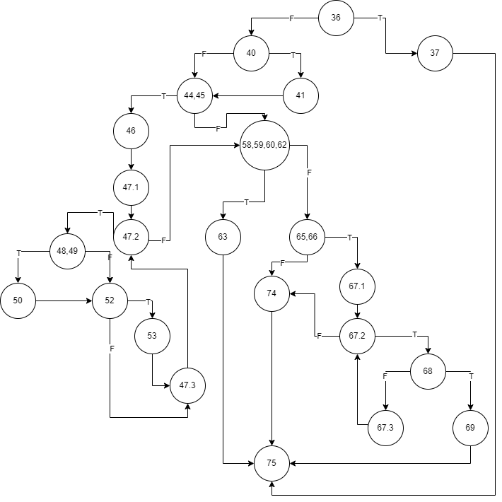

# Ангела Кранго, бр. на индекс 213008
## Цикломатска комплексност
Цикломатската комплексност на овој код е 11, истата ја добив преку формулата P+1, каде што P е бројот на предикатни јазли. Во овој случаj P=10, па цикломатската комплексност изнесува 11. Исто така цикломатската комплексност може да се добие со броење на регионите од CFG, па така бројот на региони е 11.

## Control Flow Graph (CFG)

## Тест случаи според критериумот Every Branch

| Every Branch |  | username=angela@gmail (после 41 линија) | allusers={{krango, angela@gmail.com},{krango, krango@gmail.com},{angela, krango@gmail.com}} | allusers={{krango, angela@gmail.com},{krango, krango@gmail.com},{angela, krango@gmail.com}} | allusers={{krango, angela@gmail.com},{krango, krango@gmail.com},{angela, krango@gmail.com}} |
|--------------|----------|----------|----------|----------|----------|
|              | user=null | username=null, email=angela@gmail.com, password=pass, allusers.size=0 | username=krango, email=angelagmail.com, password=p ssword, allusers.size=3 | username=krango, email=angela@gmail.com, password=p@ssword, allusers.size=3 |  username=krango, email=angela@gmail.com, password=password, allusers.size=3 |
| 36-37        | 1        |          |          |          |          |
| 37-75        | 1        |          |          |          |          |
| 36-40        |          | 1        | 1        | 1        | 1        |
| 40-41        |          | 1        |          |          |          |
| 41-44, 45    |          | 1        |          |          |          |
| 40-44, 45    |          |          | 1        | 1        |  1       |
| 44, 45-58, 59, 60, 62 |    |          | 1        |          |          |
| 44, 45-46    |          | 1        |          | 1        |  1       |
| 46-47.1      |          | 1        |          | 1        |  1       |
| 47.1-47.2    |          | 1        |          | 1        |  1       |
| 47.2-58, 59, 60, 62 |     | 1        |          | 1        | 1        |
| 47.2-48, 49  |          |          |          | 1        | 1        |
| 48, 49-50    |          |          |          | 1        | 1        |
| 50-52        |          |          |          | 1        | 1        |
| 48, 49-52    |          |          |          | 1        | 1        |
| 52-53        |          |          |          | 1        | 1        |
| 53-47.3      |          |          |          | 1        | 1        |
| 52-47.3      |          |          |          | 1        | 1        |
| 47.3-47.2    |          |          |          | 1        | 1        |
| 58, 59, 60, 62-63 |     | 1        |          |          |          |
| 63-75        |          | 1        |          |          |          |
| 58, 59, 60, 62-65, 66 |     |          | 1        | 1        | 1        |
| 65, 66-74    |          |          | 1        |          |          |
| 74-75        |          |          | 1        |          |          |
| 65, 66-67.1  |          |          |          | 1        | 1        |
| 67.1-67.2    |          |          |          | 1        | 1        |
| 67.2-74      |          |          |          |          | 1        |
| 67.2-68      |          |          |          | 1        | 1        |
| 68-67.3      |          |          |          | 1        | 1        |
| 67.3-67.2    |          |          |          | 1        | 1        |
| 68-69        |          |          |          | 1        |          |
| 69-75        |          |          |          | 1        |          |

## Тест случаи според критериумот Multiple Condition
| Combination | Possible Test Case                                                  | Branch     |
|-------------|--------------------------------------------------------------------|------------|
| TXX         | user=null, 36-37-75                                                |  36-37-75 |
| FTX         | user={username="angela", password="", email="angela@gmail.com"}   |  36-37-75  |
| FFT         | user={username="angela", password="p@ssword", email=""}           |  36-37-75  |
| FFF         | user={username="angela", password="p@ssword", email="angela@gmail.com"} | 36-40 |

## Објаснување на напишаните Unit Tests
Најпрво креаирав класа за тестирање во src/test/java која ја именував SILab2Test. Потоа креирав две функции за критериумите Every Branch (everyBranchTest) и Multiple Condition(multipleConditionTest).
### Every Branch
Соодветно во првиот тест случај каде што user=null се очекува да се фрли исклучок, па затоа се користи методата assertThrows чиј прв аргумент е класата на исклучок, а во вториот параметар ја повикувам методата function од SILab2 со соодветните аргументи. Исклучокот го чувам во променлива ex, а потоа со assertTrue ја споредувам пораката на исклучокот со очекуваната порака. Во следните 4 тест случаи користев assertFalse бидејќи со соодвентните аргументи за методот function, се очекува да се врати false по завршување на методот.
### Multiple Condition
За овој критериум потребно е да се тестираат 4 случаи, односно TXX, FTX, FFT, FFF, каде секоја од знаците одговара на секој од 3те делови од условот. Во првите 3 тест случаи се очекува да се фрли исклучок, па затоа ја повторуваме истата постапка која беше опишана погоре. Во последниот тест случај се очекува да се врати true по извршување на методот function (бидејќи users is empty), па за таа цел се користи asssertTrue.
